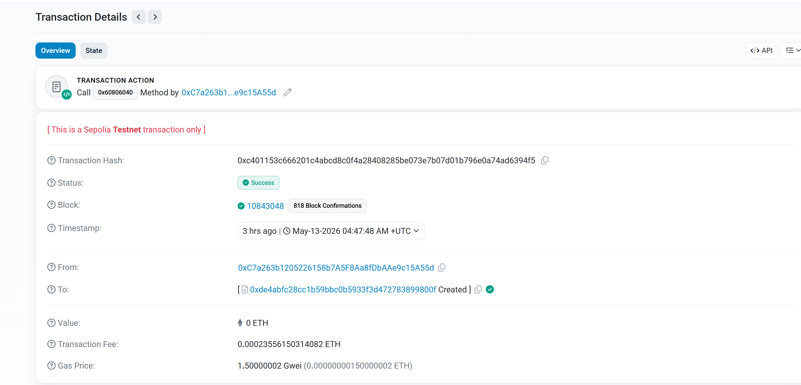

# first-contract

一个部署在 **Sepolia 测试网** 的 Solidity 智能合约。

## Counter 合约

这是一个简单的计数器合约，基于 Solidity `^0.8.0` 编写。

### 合约代码

```solidity
// SPDX-License-Identifier: MIT
pragma solidity ^0.8.0;

contract Counter {
    uint256 public counter;

    function get() public view returns (uint256) {
        return counter;
    }

    function add(uint256 x) public {
        counter += x;
    }
}
```

### 功能说明

- `counter` — 公开的状态变量，存储当前计数值
- `get()` — 读取当前计数值（view 函数，不消耗 gas）
- `add(uint256 x)` — 将计数值增加 `x`

### 部署信息

- **网络**: Sepolia 测试网
- **合约地址**: [0x3f263a585194e6609ad2b1a43d27f065f77f42b1](https://sepolia.etherscan.io/address/0x3f263a585194e6609ad2b1a43d27f065f77f42b1)
- **区块链浏览器**: [Etherscan (Sepolia)](https://sepolia.etherscan.io/address/0x3f263a585194e6609ad2b1a43d27f065f77f42b1)

### 运行结果


